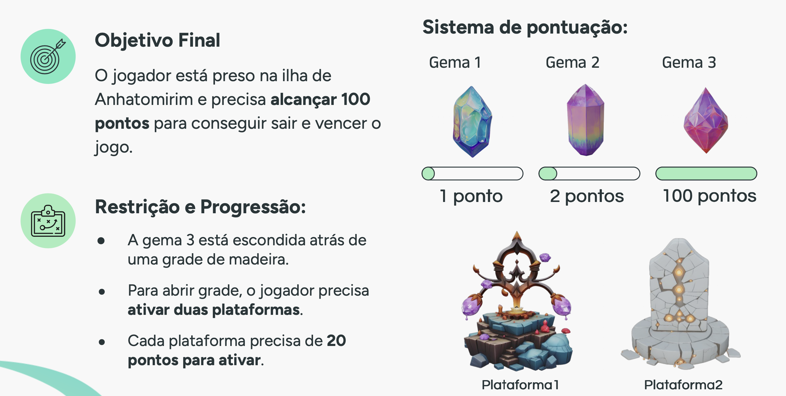

# TCC — Manual Prático de Uso de Inteligência Artificial Gerativa na Criação de Modelos 3D para Jogos Digitais

Trabalho de Conclusão de Curso apresentado como requisito parcial para obtenção do grau de Bacharel em Ciências da Computação,
pela Universidade Federal de Santa Catarina.

## 📄 Sobre o trabalho
- Autora: Emily Sayuri Kiba
- Orientador: Prof. Dr. Aldo von Wangenheim
- Instituição: UFSC
- Ano: 2025

## 📂 Estrutura do repositório
```text

- `tcc/` — Arquivos em LaTeX do Trabalho de Conclusão de Curso
- `sbc/` — Artigo no formato SBC (apêndice do TCC)
```

## 📌 Resumo
Este trabalho investiga a aplicação de Inteligência Artificial gerativa, em especial o Stable Diffusion, na modelagem 3D e sua integração no contexto de jogos.
O foco é a criação de um manual prático que demonstra o uso da IA tanto para a geração de conceitos visuais quanto para a criação de malhas e texturas tridimensionais, visando agilizar e tornar o processo de modelagem mais acessível.

## 🎮 Lógica do Jogo


### ▶️ Demonstração do Jogo
[](https://www.youtube.com/watch?v=f3wWPZTIt18)
